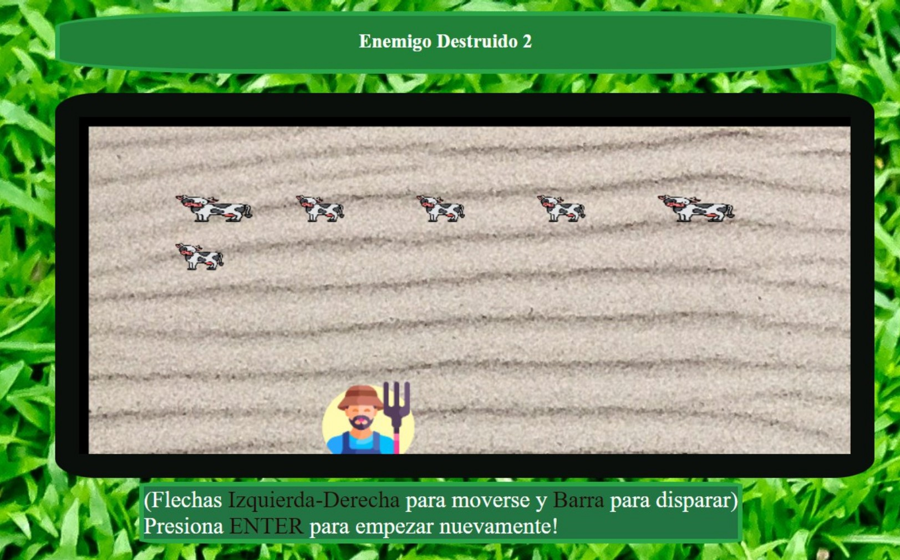

# Granjero - Juego Interactivo

¡Bienvenido a "Granjero" Un divertido juego interactivo en el que te convertirás en un granjero y tendrás que proteger tu granja disparando agua a los animales traviesos que intentan arruinar tus cultivos.

## Características

- Juego interactivo en el que controlas a un granjero que dispara agua.
- Objetivo: Defiende tus cultivos mojando a los animales para mantenerlos alejados.
- Utiliza el teclado para apuntar y disparar. (Flechas izquierda-Derecha para moverse y barra para disparar."Enter"para Reiniciar.
- Gráficos y animaciones fluidas creadas con HTML, CSS y JavaScript.
- Integración de imágenes JPG y PNG para representar los animales y los elementos de la granja.
- Acompañado de una banda sonora entretenida con el archivo de música MP3.
  (StrangerThings)
  
## Recursos Utilizados /Derechos de Autor

 - Robot iconos animados creados por Freepik - Flaticon.
 - Foto de pixmike: https://www.pexels.com/es-es/foto/cesped-verde-413195/
 - Music by Music_Unlimited from Pixabay.
 
## Tecnologías utilizadas

- HTML: Estructura y marcado de la página web.
- CSS: Estilos y diseño visual.
- JavaScript: Lógica del juego y manipulación de elementos interactivos.
- Imágenes: Utilización de imágenes JPG y PNG para representar los elementos visuales del juego.
- Música: Archivo de música MP3 para brindar una experiencia auditiva envolvente.

## Instrucciones de instalación y ejecución

1. Clona el repositorio a tu máquina local.
2. Abre el archivo `index.html` en tu navegador web.
3. ¡Disfruta del juego! Utiliza el mouse o el teclado según las indicaciones en pantalla para jugar.

## Capturas de pantalla

## Demo en vivo

Puedes jugar al Granjero en vivo en el siguiente enlace: [Enlace a la demo](https://orivero83.github.io/Granjero/))

## Contribuciones

Las contribuciones son bienvenidas. Si deseas mejorar el juego, corregir errores o agregar nuevas características, siéntete libre de enviar una solicitud de extracción.

## Licencia

¡Diviértete defendiendo tu granja en Granjero! ¡Buena suerte!
